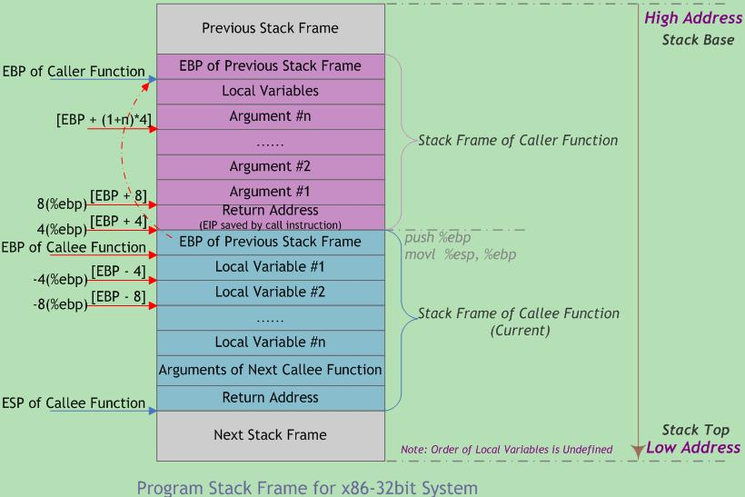

### 机器指令与程序优化

#### 汇编
1. 通用寄存器
  * 2byte寄存器：ax、bx、cx
  * 4byte寄存器：eax、ebx、ecx，以e开头
  * 8byte寄存器：rax、rbx、rcx，以r开头
1. 通用寄存器(64 位处理器设计)
  * %rax(%eax) 用于做累加
  * %rcx(%ecx) 用于计数
  * %rdx(%edx) 用于保存数据
  * %rbx(%ebx) 用于做内存查找的基础地址
  * %rsi(%esi) 用于保存源索引值
  * %rdi(%edi) 用于保存目标索引值
1. %rsp(%esp) 栈指针（Stack Pointer）
1. %rbp(%ebp) 基指针（Base Pointer），也可以称为栈帧指针（Frame Pointer）
1. 操作数的三种基本类型：
  * 立即数(Imm)
  * 寄存器值(Reg)
  * 内存值(Mem)。
1. 以movq为例：movq [Imm|Reg|Mem], [Reg|Mem]，第一个是源操作数，第二个是目标操作数
  * movq Imm, Reg -> mov $0x5, %rax -> temp = 0x5;
  * movq Imm, Mem -> mov $0x5, (%rax) -> *p = 0x5;
  * movq Reg, Reg -> mov %rax, %rdx -> temp2 = temp1;
  * movq Reg, Mem -> mov %rax, (%rdx) -> *p = temp;
  * movq Mem, Reg -> mov (%rax), %rdx -> temp = *p;
  * movq Mem, Mem，这种情况不存在，不能用一条指令完成内存间的数据交换
1. 上面的例子中，操作数带括号表示寻址，分两种情况：
  * (R)，指寄存器 R 保存的是一个内存地址，类似C语言的指针，movq (%rcx), %rax 也就是说以 %rcx 寄存器中存储的地址去内存里找对应的数据，存到寄存器 %rax 中
  * D(R)，D是偏移量，movq 8(%rbp),%rdx 也就是说以 %rbp 寄存器中存储的地址再加上 8 个偏移量去内存里找对应的数据，存到寄存器 %rdx 中
  * D(Rb, Ri, S)，表示内存地址是Rb + Ri * S + D。其中：
    1. D - 常数偏移量
    1. Rb - 基寄存器
    1. Ri - 索引寄存器，不能是 %rsp
    1. S - 系数
1. 举例说明，假设 %rdx 中的存着 0xf000，%rcx 中存着 0x0100，那么：
  * 0x8(%rdx) = 0xf000 + 0x8 = 0xf008
  * (%rdx, %rcx) = 0xf000 + 0x100 = 0xf100
  * (%rdx, %rcx, 4) = 0xf000 + 4*0x100 = 0xf400
  * 0x80(, %rdx, 2) = 2*0xf000 + 0x80 = 0x1e080
1. 以leaq Src, Dst为例，leaq (%rdi, %rdi, 2), %rax 表示%rdi * 3，再把值给%rax
1. 需要两个操作数的指令：
  * addq Src, Dest -> Dest = Dest + Src
  * subq Src, Dest -> Dest = Dest - Src
  * imulq Src, Dest -> Dest = Dest * Src
  * salq Src, Dest -> Dest = Dest << Src，左移Src位
  * sarq Src, Dest -> Dest = Dest >> Src，右移Src位（算术右移）
  * shrq Src, Dest -> Dest = Dest >> Src，右移Src位（逻辑右移）
  * xorq Src, Dest -> Dest = Dest ^ Src，取或
  * andq Src, Dest -> Dest = Dest & Src，取与
  * orq Src, Dest -> Dest = Dest | Src，取非
1. 需要一个操作数的指令：
  * incq Dest -> Dest = Dest + 1
  * decq Dest -> Dest = Dest - 1
  * negq Dest -> Dest = -Dest
  * notq Dest -> Dest = ~Dest  
1. C++ 内存区域分为5个区域：  
  * 栈(stack)：只能在一端进行push和pop的数据结构，栈默认大小是1M
  * 堆(heap)：用数组实现的二叉树。由new分配的内存块
  * 自由存储区：由malloc等分配的内存块
  * 全局/静态存储区：全局变量和静态变量被分配到同一块内存中
  * 常量存储区：比较特殊的存储区，里面存放的是常量，不允许修改
1. 流程控制：
  * %rip 是指令指针。也可以成为程序计数器，即PC（Program Counter）
  * 条件代码的四个表示位：
    1. CF: Carry Flag (针对无符号数)。如果两个数相加，在最高位还需要进位（溢出）
    1. ZF: Zero Flag。运算结果等于0
    1. SF: Sign Flag (针对有符号数)。运算结果小于0
    1. OF: Overflow Flag (针对有符号数)。2的补码溢出
  * 这四个条件代码，是用来标记上一条命令的结果的各种可能的。例如指令：cmpq %rsi, %rdi
1. 过程调用（也就是调用函数）涉及三个重要的方面（凭借机器指令实现）：
  * 传递控制：包括如何开始执行过程代码，以及如何返回到开始的地方
  * 传递数据：包括过程需要的参数以及过程的返回值
  * 内存管理：如何在过程执行的时候分配内存，以及在返回之后释放内存
1. 过程调用的参数如果没有超过6个，存在%rdi, %rsi, %rdx, %rcx, %r8, %r9。超过则保存在栈中。返回值存在%rax
1. 对于每个过程调用来说，都会在栈中分配一个帧 Frame，其中又分为调用者栈帧和被调用者栈帧
1. 调用者栈帧：
  * 返回地址（调用 call 指令压入栈的）
  * 调用所需的参数
1. 被调用者栈帧：
  * 需要使用的参数
  * 本地变量
  * 寄存器的值
  * 老的栈帧的指针（可选）

#### 数据存储
1. 多维数据在内存的存储是连续的，例如int[2][3]，表示两行三列，在内存的排列如下：
  * A[0][0]、A[0][1]、A[0][2] A[1][0]、A[1][1]、A[1][2] A[2][0]、A[2][1]、A[2][2]
1. 多维数组另一种存储方式：同一行内的列内存是连续的，不同行内存不连续，数组保存每一行的起始位置
1. 结构体的内存存放需要遵循对齐规则，Linux中的对齐策略是：
  * [linux内存对齐](https://blog.csdn.net/u011308691/article/details/16357755)
  * 编译器有默认的对齐系数，可以通过预编译命令#pragma pack(n)来改变，Linux下x86平台的n为4； x86_64平台n为8
  * 成员变量的内存起始位置必须是min(n, 当前成员变量的内存字节长度)的倍数
  * 机构体所占据的内存空间必须是最大成员变量的内存字节长度的倍数
1. 结构体的内存对齐的原因：例如int a的地址是0x00fffff9，则其字节分布在0xffff000e～0xffff0012空间内，为了读取这个int，cpu必须对0xffff0008和0xffff0010进行两次内存读取
1. 结构体的内存对齐的例子（x86_64平台）：
  * struct {int a[4]; size_t i; char \*p;} 内存排列是4*4 + 8 + 8
  * struct {char c; int i[2]; double v;} 内存排列是1+3 + 4*2+4 + 8
  * struct {double v; int i[2]; char c;} 内存排列是8 + 4*2 + 1+7
  * struct {char c; int i; char d;} 内存排列是1+3 + 4 + 1+3
  * struct {int i; char c; char d;} 内存排列是4 + 1 + 1+2

#### 缓存区溢出攻击
1. [C语言函数调用栈(一)](https://www.cnblogs.com/clover-toeic/p/3755401.html)
1. %rbp 基指针指向栈底(高地址)
1. %rsp 栈指针指向栈顶(低地址)
1. 每一个栈帧的结构(从高地址到低地址)：
  1. 上一帧的%rbp地址
  1. 本地变量、寄存器的值、老的栈帧的指针
  1. 下一帧的所需参数
  1. 下一帧的返回地址(即当前代码的下一条指令)
1. 如上，当前%rbp始终指向1和2之间的位置。%rsp动态调整，保证指向栈底。过程调用开始时先执行1，再设置当前的%rbp，然后开始执行代码逻辑。
1. 
  
  
  
  
  
  
  
  
  
  
  
  
  
  
  
  
  
  
  
  
  
  
  
  
  
  
  
  
  
  