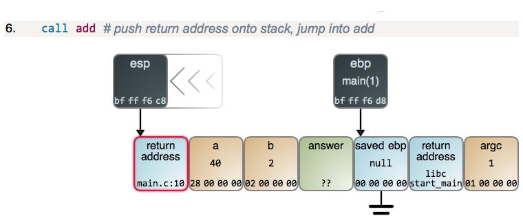
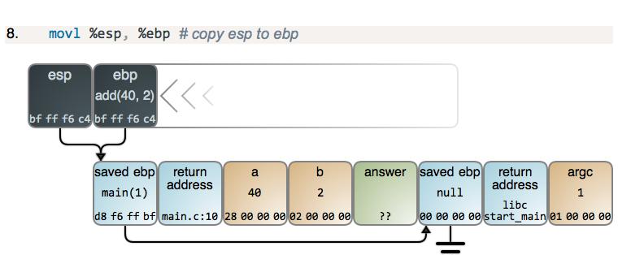
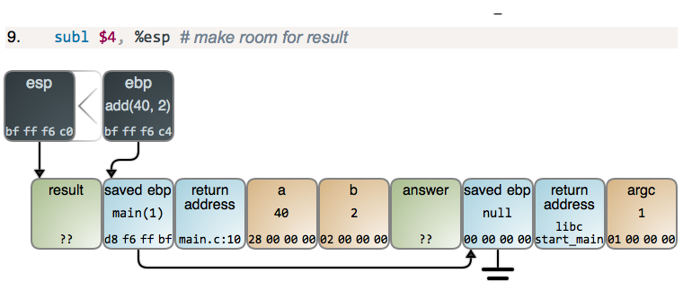

<link rel="stylesheet" href="../extra/ideal-image-slider.css">
<link rel="stylesheet" href="../extra/ideal-default-theme.css">
<script src="../extra/ideal-image-slider.js"></script>
<script src="../extra/ideal-iis-bullet-nav.js"></script>
<script>
var gitbook = gitbook || [];
gitbook.push(function() {
    let slider = new IdealImageSlider.Slider('.IdealImageSlider');
    slider.addBulletNav();
})
</script>

### CSAPP深入理解计算机系统·CSDN

#### 第二章：信息的表示和处理
1. 三种最常用的表示数字的方法：
  * unsigned无符号整型
  * two's-complement，2的补码
    1. 1的补码——反码，例如+1是0000 0001，-1就是1111 1110。这种表示法，0有两个形式：0000 0000和1111 1111。范围是（-127~127）
    1. 2的补码——补码，在1的补码的基础上，把-0的位置给-1，多了一个位置给-128。范围是（-128~127）
  * 浮点型：2为基的科学记数法，用以表示实数
1. bit-level operations in C：
  * 与 &
  * 或 |
  * 非 ~
  * 异或 ^：两个一真一假时为真
1. logical operations in C:
  * 与 &&
  * 或 ||
  * 非 ! 
1. shift operations in C：
  * 左移时右边补0
  * 右移分为两种情况：
    1. 逻辑右移：即右移时左边补零；
    1. 算数右移：即右移时左边补最高位的值。

#### 第三章：机器级的代码表示
1. leaq，类似mov，但是不引用源操作数寄存器的值
1. 位的运算
  * addq Src, Dest	//Dest = Dest + Src
  * subq Src, Dest	//Dest = Dest - Src
  * imulq Src, Dest //Dest = Dest * Src
  * salq Src, Dest	//Dest = Dest<<Src 也称为shlq
  * sarq Src, Dest  //Dest = Dest>>Src 算数右移
  * shrq Src, Dest	//Dest = Dest<<Src 逻辑右移
  * xorq Src, Dest  //Dest = Dest ^ Src
  * andq Src, Dest  //Dest = Dest & Src
  * orq Src, Dest	  //Dest = Dest | Src
1. 特殊算术运算：
  * imull S //有符号全64位乘法
  * mull S //无符号全64位乘法
  * cltd //convert long to double转为4字
  * idivl S //有符号除法
  * divl S //无符号除法
1. 跳转指令
  * jmp	Always jump	
  * ja	Jump if above(unsigned >)
  * je/jz	Jump if eq / zero	
  * jae	Jump if above / equal
  * jne/jnz	Jump if !eq / !zero	
  * jb	Jump if below(unsigned <)
  * jg	Jump if greater	
  * jbe	Jump if below / equal
  * jge	Jump if greater / eq	
  * js	Jump if sign bits is 1(neg)
  * jl	Jump if less	
  * jns	Jump if sign bit is 0 (pos)
  * jle	Jump if less / eq

#### 第三章 栈帧
1. pushq Src 指令：
  * 获取Src处的操作数
  * 将%rsp值减8
  * 在%rsp指向的地址处写入操作数
1. popq Dest 指令：
  * 读取%rsp指向的地址处的值
  * 将%rsp值加8
  * 将读取的值存入Dest（通常是个寄存器）

```
int add(int a, int b)
{
    int result = a + b;
    return result;
}

int main(int argc)
{
    int answer;
    answer = add(40, 2);
}
```

<div class="IdealImageSlider">
    
    
    
    
    
    
    
    
    
    
    
</div>

1. 在运行时，每一栈帧将对应两个寄存器：
  * %ebp指向的单元保存上一栈帧的%ebp；
  * 在进入下一函数前，%esp指向的单元保存当前栈帧的返回地址。
1. 栈帧中的内容(高地址~低地址)：
  * %ebp+4，返回地址
  * %rbp，上一栈帧的%ebp
  * 局部存储信息（如果需要的话），比如寄存器的值
  * 暂时的空间（如果需要的话），比如局部变量
  * 调用其他函数时可能需要的参数
1. 管理方法：
  * 当进入某一过程时开辟空间
    1. set up 代码
    1. call指令包含了push
  * 离开过程时释放空间
    1. finish 代码
    1. ret指令包含了pop
1. 函数的参数用哪些寄存器来存放呢？
  * 按惯例，前6个arguments存放在：%rdi、%rsi、%rdx、%rcx、%r8、%r9
  * 超过了6个，更多的参数则存放到栈中
  * 函数的返回值使用寄存器%rax来保存
1. 在函数调用时由谁保管暂时值？
  * “caller saved”：由caller在它自己的frame中保管暂存值，在执行call之前保管
  * “callee saved”：由callee在它的frame中保管；callee负责在返回给caller时恢复寄存器们的值


