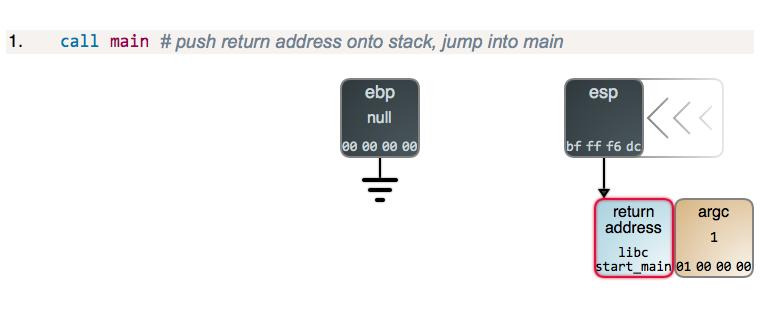
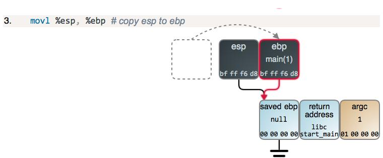

<link rel="stylesheet" href="../extra/ideal-image-slider.css">
<link rel="stylesheet" href="../extra/ideal-default-theme.css">
<script src="../extra/ideal-image-slider.js"></script>
<script src="../extra/ideal-iis-bullet-nav.js"></script>
<script>
var gitbook = gitbook || [];
gitbook.push(function() {
    let slider = new IdealImageSlider.Slider('.IdealImageSlider');
    slider.addBulletNav();
})
</script>

### CSAPP深入理解计算机系统·CSDN

#### 参考资料
1. [CSAPP深入理解计算机系统笔记](https://blog.csdn.net/qq_41230365/article/details/88638784)

#### 第二章：信息的表示和处理
1. 三种最常用的表示数字的方法：
  * unsigned无符号整型
  * two's-complement，2的补码
    1. 1的补码——反码，例如+1是0000 0001，-1就是1111 1110。这种表示法，0有两个形式：0000 0000和1111 1111。范围是（-127~127）
    1. 2的补码——补码，在1的补码的基础上，把-0的位置给-1，多了一个位置给-128。范围是（-128~127）
  * 浮点型：2为基的科学记数法，用以表示实数
1. bit-level operations in C：
  * 与 &
  * 或 |
  * 非 ~
  * 异或 ^：两个一真一假时为真
1. logical operations in C:
  * 与 &&
  * 或 ||
  * 非 ! 
1. shift operations in C：
  * 左移时右边补0
  * 右移分为两种情况：
    1. 逻辑右移：即右移时左边补零；
    1. 算数右移：即右移时左边补最高位的值。

#### 第三章：机器级的代码表示
1. leaq，类似mov，但是不引用源操作数寄存器的值
1. 位的运算
  * addq Src, Dest	//Dest = Dest + Src
  * subq Src, Dest	//Dest = Dest - Src
  * imulq Src, Dest //Dest = Dest * Src
  * salq Src, Dest	//Dest = Dest<<Src 也称为shlq
  * sarq Src, Dest  //Dest = Dest>>Src 算数右移
  * shrq Src, Dest	//Dest = Dest<<Src 逻辑右移
  * xorq Src, Dest  //Dest = Dest ^ Src
  * andq Src, Dest  //Dest = Dest & Src
  * orq Src, Dest	  //Dest = Dest | Src
1. 特殊算术运算：
  * imull S //有符号全64位乘法
  * mull S //无符号全64位乘法
  * cltd //convert long to double转为4字
  * idivl S //有符号除法
  * divl S //无符号除法
1. 跳转指令
  * jmp	Always jump	
  * ja	Jump if above(unsigned >)
  * je/jz	Jump if eq / zero	
  * jae	Jump if above / equal
  * jne/jnz	Jump if !eq / !zero	
  * jb	Jump if below(unsigned <)
  * jg	Jump if greater	
  * jbe	Jump if below / equal
  * jge	Jump if greater / eq	
  * js	Jump if sign bits is 1(neg)
  * jl	Jump if less	
  * jns	Jump if sign bit is 0 (pos)
  * jle	Jump if less / eq

#### 第三章 栈帧
1. pushq Src 指令：
  * 获取Src处的操作数
  * 将%rsp值减8
  * 在%rsp指向的地址处写入操作数
1. popq Dest 指令：
  * 读取%rsp指向的地址处的值
  * 将%rsp值加8
  * 将读取的值存入Dest（通常是个寄存器）

```
int add(int a, int b)
{
    int result = a + b;
    return result;
}

int main(int argc)
{
    int answer;
    answer = add(40, 2);
}
// 栈帧的变化见下面的幻灯片
```

<div class="IdealImageSlider">
    
    
    
    
    
    
    
    
    
    
    
</div>

1. 在运行时，每一栈帧将对应两个寄存器：
  * %ebp指向的单元保存上一栈帧的%ebp；
  * 在进入下一函数前，%esp指向的单元保存当前栈帧的返回地址。
1. 栈帧中的内容(高地址~低地址)：
  * %ebp+4，返回地址
  * %ebp，上一栈帧的%ebp
  * 局部存储信息（如果需要的话），比如寄存器的值
  * 暂时的空间（如果需要的话），比如局部变量
  * 调用其他函数时可能需要的参数
1. 管理方法：
  * 当进入某一过程时开辟空间
    1. set up 代码
    1. call指令包含了push
  * 离开过程时释放空间
    1. finish 代码
    1. ret指令包含了pop
1. 函数的参数用哪些寄存器来存放呢？
  * 按惯例，前6个arguments存放在：%rdi、%rsi、%rdx、%rcx、%r8、%r9
  * 超过了6个，更多的参数则存放到栈中
  * 函数的返回值使用寄存器%rax来保存
1. 在函数调用时由谁保管暂时值？
  * “caller saved”：由caller在它自己的frame中保管暂存值，在执行call之前保管
  * “callee saved”：由callee在它的frame中保管；callee负责在返回给caller时恢复寄存器们的值

#### 第十章 系统级IO
1. 文件类型：
  * regular file：包含任意数据；
  * directory：相关的一组文件的索引；
  * socket：为了与另一台机器上的进程通信
  * 其他格式：Named pipes（FIFOs）、Symbolic links、Character and block devices
1. read和write传送的字节数比应用程序要求的少，返回的值称为“不足值”（short count），这些情况有：
  * 读时遇到EOF，此时读函数返回0以表示读到了文件末尾；
  * 从终端读文本行。若打开文件是与终端相关联的，那么每个read函数将一次传送一个文本行，返回的不足值等于文本行的大小。
  * 读和写网络套接字（socket）。若打开的文件对应于网络套接字，那么较长的网络延迟和内部缓冲约束会引起read和write返回不足值。
  * 对unix管道调用read和write时也可能出现不足值。

#### 第十一章 网络编程
1. 每台主机上有个网络适配器，从网络上接收到的数据经由适配器->I/O总线->存储总线->到达主存。
1. 每个适配器有一个唯一的48位地址（MAC address，如f0:18:98:4f:d0:be）
1. 当它发送一段位（帧）到网段上的任何主机时，每个主机适配器都能看到这个帧，但只有目的主机实际读取它。
1. 这样的多个计算机（host）由一些电缆连接到一个集线器（hub）构成的网络称为以太网段，这是最底层的网络结构。
1. 集线器（hub）的功能本质上就是个复读机+广播，它把从任意端口接收到的信息都复制，再广播给其他端口。
1. 把不同区域的集线器使用被称作网桥（bridge）（高密度端口的网桥其实就是交换机）
1. 集线器只是复读机，而网桥则更聪明，它能学会有选择性地传输信息。到这个层面依然只是局域网（LAN）
1. 把不同区域的不兼容局域网采用被称作路由器（router）的盒子连接起来，那就组成了所谓的“互联网”（Internet）
1. 基于TCP/IP协议族：
  * IP（Internet Protocol）：提供基本命名格式和不可靠的传输机制，是host-to-host的；
  * UDP（Unreliable Datagram Protocol）：稍微扩展了IP协议，包可以在process-to-process间传递，而不是在主机间传送；
  * TCP（Transmission Control Protocol）：构建在IP协议之上的复杂协议，提供了可靠的process-to-process连接（connections）。
1. 上网的流程：
  * 主机被映射到一个32位的IP地址：如 172.20.10.9（每个字节写成一个十进制数，例如0x8002C2F2 == 128.2.194.242）
  * IP地址被映射为域名：如www.cs.cmu.edu，注：域名与IP地址是多对多的映射。DNS（域名服务器）
  * 一个位于网络上的主机上的进程可以通过一个“connection”与另一个主机上的进程进行信息交流。
  * 注：32位的IP地址是IPv4（第四代），升级到128位之后称为IPv6
1. 网络连接：
  * 客户端和服务端是通过“连接”（connections）来传输字节流的。
  * 一个套接字是连接的一个端点，每个套接字有相应的套接字地址，由一个因特网地址和一个16位的整数端口组成：IP：port。
  * 一个端口用于标记一个进程。当客户端发起连接请求时，其套接字地址中的端口是由内核自动分配，称为临时端口。然而，服务器套接字地址中的端口通常是某个知名端口
  * 由客户端发起一个请求：128.2.194.242:80（即网页服务），服务端128.2.194.242的内核收到该信号，建立起与自己的Web server的连接。套接字对：（cliaddr::cliport, servaddr::servport）
1. Sockets：
  * 对于开发者来说，一个Socket就是一个file descriptor，它使得应用程序能读或者写网络。注：所有Unix I/O设备，包括网络，都被抽象成了文件！
  * 对于内核来说，一个socket就是通信的一个端点。
1. 常识：
  * 集线器淘汰多年，已被交换机彻底取代；
  * 路由器内带着一只交换机，功能比交换机强多了；
  * 路由器=网络拨号+共享上网+交换机
