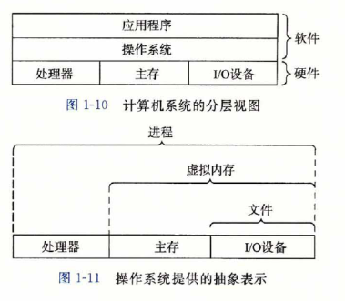

<link rel="stylesheet" href="../extra/ideal-image-slider.css">
<link rel="stylesheet" href="../extra/ideal-default-theme.css">

### 深入理解计算机系统·语雀

#### 参考资料
1. [深入理解计算机系统.语雀](https://www.yuque.com/tvvhealth/cs/taaqns)

#### 一、计算机系统漫游
1. hello程序执行过程
  * shell中输入hello：字符串通过键盘IO，bus总线，存储到寄存器中，再由寄存器保存到主存中。
  * 输入回车键：shell开始执行hello，通过DMA技术不经过CPU把磁盘中的hello程序直接加载到主存中。
  * 处理器执行hello程序：将执行结果hello word复制到寄存器中，再从寄存器复制到显示设备，最终显示。
1. 操作系统的抽象

1. 进程是操作系统对一个正在运行程序的抽象，计算机科学中最重要最成功的的概念。
1. 并发运行，不同进程的指令交错执行。大多数系统中，进程数一般多于运行它们的CPU个数。
1. 一个CPU“同时执行”多个进程是通过CPU在进程间快速切换实现的，这种机制称为上下文切换。
  * 上下文（context），操作系统保持跟踪进程运行的所有状态信息，包括PC、寄存器、主存内容。
  * 上下文切换，即保存当前进程上下文，恢复新进程上下文，控制权转移给新进程，新进程从上次停止的地方开始。
  * 上下文切换由操作系统内核（kernel）完成，内核是操作系统代码常驻内存的部分，它不是进程，是系统管理全部进程所用的代码和数据结构的集合，可以简单理解为常驻内存的数据。
1. 虚拟内存（所有进程的代码都是从同一固定地址开始）

#### 三、程序的机器级表示
1. 实数在汇编代码里的后缀

1.  数据传送指令：mov指令
  * mov S, D：S内容复制到D
  * S可以是立即数，内存地址，寄存器地址；
  * D可以是内存地址，寄存器地址。
  * S的D不能同时是内存地址
  * movb：寄存器必须是1byte；movw：寄存器必须是2byte；movl：寄存器必须是4byte；movq：寄存器必须是8byte。
1. 数据传送指令：movs。使用场景如，char的整形复制给int，1byte扩展成4byte
1. C语言对应的汇编代码

|C语言 |对应指令 |
| ---  |---     |
|long *dp; long *sp; *dp = (long) *sp; |movq (%rdi), %rax movq %rax, (%rsi) |
|int *dp; char *sp; *dp = (int) *sp;              |movsbl (%rdi), %eax movl %eax, (%rsi)|
|unsigned *dp; char *sp; *dp = (unsigned int) *sp;|movsbl (%rdi), %eax movl %eax, (%rsi)|
|long *dp; unsinged char *sp; *dp = (long) *sp;   |movsbq (%rdi), %rax movq %rax, (%rsi)|
|char *dp; int *sp; *dp = (char) *sp;             |movl (%rdi), %eax movb %al, (%rsi)   |
|unsigned char *dp; unsigned *sp; *dp = (unsigned char) *sp;|movl (%rdi), %eax movb %al, (%rsi)|
|short *dp; char *sp; *dp = (short) *sp;          |movsbw (%rdi), %ax movw %ax, (%rsi)  |

